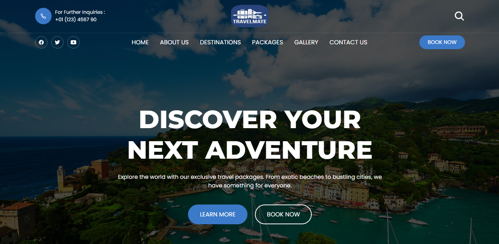
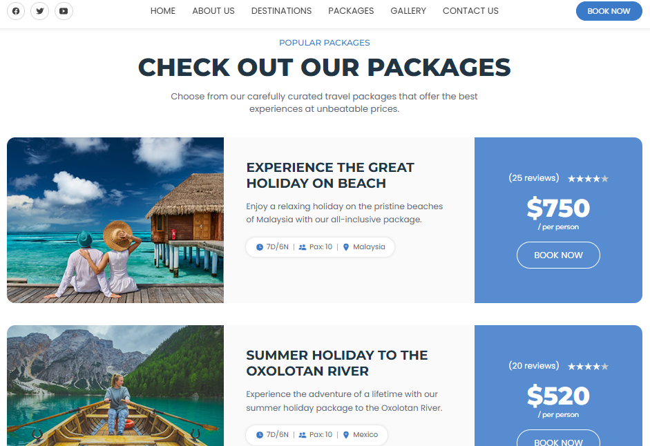
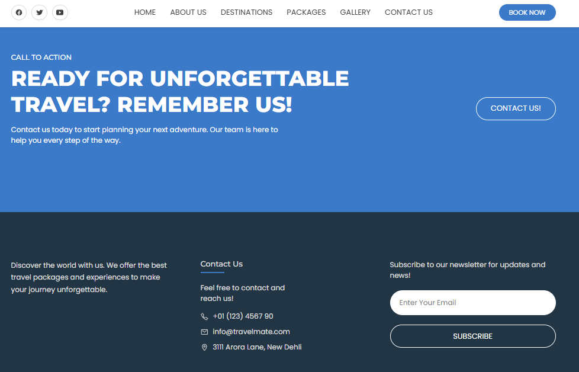

# TravelMate

**TravelMate** is a mock travel booking website designed to showcase the process of booking travel packages and flights for various tourist destinations. This project focuses on creating a visually appealing and interactive frontend using HTML, CSS, and JavaScript.

## Features
- **Tourist Packages**: Browse and book travel packages for popular destinations.
- **Flight Booking**: Simulate the process of booking flights for your travels.
- **Responsive Design**: Optimized for desktop and mobile devices to provide a seamless user experience.
- **Interactive Elements**: Dynamic features like dropdown menus, sliders, and form validation.
- **Hotel Booking**: Buttons for booking and reserving hotels at required destinations

## Technologies Used
- **HTML**: Structuring the content and layout.
- **CSS**: Styling the website to make it visually appealing, including animations and responsiveness.
- **JavaScript**: Adding interactivity and functionality, such as form validations and dynamic updates.

## Screenshots of the Website

**Front Page**  

**Package Selector**  

**Footer**  

## Future Improvements
Integrate a backend for real-time booking and user management.
Add a payment gateway for secure transactions.
Implement user authentication for personalized experiences.